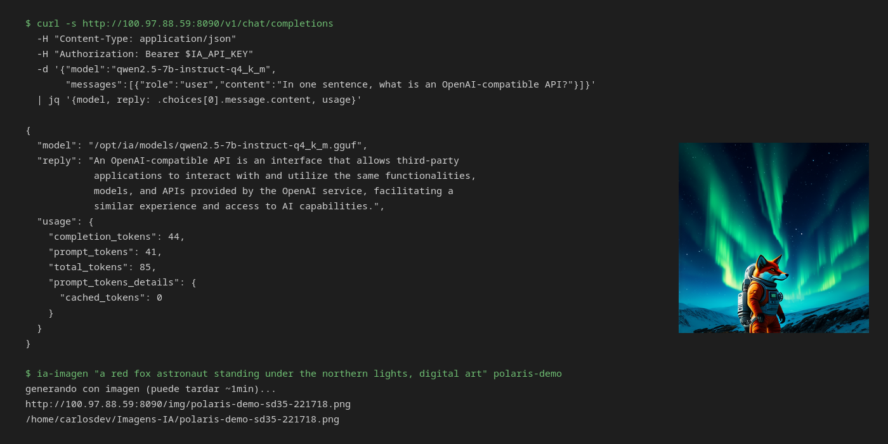

# polaris-local-ai

[English](README.md) · **Español**

**Una pila de IA completa y local — texto, visión y generación de imágenes — en
una AMD Radeon RX 580 2048SP (8 GB de VRAM) con 32 GB de RAM.** Sin nube, sin
facturas de API. También sirve como motor de inferencia para un agente de
programación/asistente de IA (Hermes Agent).



> **Inspirado en [Strata](https://github.com/Niko1221/Strata).**
> Strata demostró que un stack de inferencia local serio se puede empaquetar
> para que una persona normal lo ejecute en una PC normal. Este repositorio
> sigue esa misma idea: un script de instalación, una API compatible con OpenAI
> en localhost, documentación con números reales — pero para hardware más
> antiguo y con otro motor. Aquí no hay código de Strata. Créditos a su autor
> por el concepto y por el estándar que fijó.
> Ver [LICENSE](LICENSE) para el aviso completo.

---

## Por qué existe

Strata apunta a tarjetas de 12 GB o más, de la serie RX 6800 en adelante, y su
ruta AMD requiere ROCm 7, que dejó atrás la arquitectura Polaris hace años. Una
RX 580 — todavía muy común — queda fuera de su alcance.

A esta pila eso no le importa. Corre sobre **Vulkan a través del driver RADV de
Mesa**, que soporta Polaris perfectamente, y se apoya en **32 GB de RAM del
sistema** para los modelos que no caben en 8 GB de VRAM. El resultado: seis
modelos de texto/visión y dos modelos de imagen, todos accesibles a través de
un único endpoint compatible con OpenAI.

## Qué obtienes

| | |
|---|---|
| **Texto** | 6 modelos, desde un coder de 1.5 B hasta un MoE de 30 B, intercambiados bajo demanda |
| **Visión** | Qwen2.5-VL 3 B con su proyector mmproj |
| **Imágenes** | SD 3.5 Medium y SD 1.5 a través de stable-diffusion.cpp |
| **API** | Un endpoint compatible con OpenAI, una API key, 6 ids de texto/visión + generación de imágenes |
| **Agente** | Funciona como motor backend de Hermes Agent, con tools MCP |
| **Huella** | Corre en un LXC de Debian sobre un host Proxmox, o en bare metal |

Los números medidos, los pasos de instalación, la guía de modelos y todo lo que
se rompió en el camino están en [`docs/`](docs/):

- [EXPECTATIONS.md](docs/EXPECTATIONS.md) — **empieza por aquí**: qué esperar y cómo usarlo bien
- [HARDWARE.md](docs/HARDWARE.md) — qué corre en esta tarjeta y qué no
- [BENCHMARKS.md](docs/BENCHMARKS.md) — tokens/segundo, cold vs warm, latencia de agente — medido
- [MODELS.md](docs/MODELS.md) — qué modelo para cada tarea
- [SETUP.md](docs/SETUP.md) — instalación desde cero
- [HERMES.md](docs/HERMES.md) — usarlo como motor de agentes
- [TROUBLESHOOTING.md](docs/TROUBLESHOOTING.md) — los bugs que encontramos

## Cómo se siente en la práctica

Medido en esta máquina, no estimado. Mismo prompt, mismo modelo, dos estados:

| Situación | Tiempo total |
|---|---:|
| Llamada **warm**, modelo ya cargado | **3,1 – 14,1 s** |
| Llamada **cold**, recién después de un swap | **11,0 – 55,0 s** |
| Primer mensaje a un agente, sesión nueva | **~161 s** |
| Cada mensaje posterior en esa misma sesión | **~21 – 25 s** |

**La fila 1 vs la fila 2 es el swap** — 7,9–38,5 s para reiniciar llama-server
con los pesos nuevos. La velocidad de generación es idéntica en ambos estados
(21–99 tok/s); un modelo frío no es más lento, tarda más en *llegar*. Mantén un solo modelo
cargado durante toda la sesión y vives en la fila 1.

**La fila 2 vs la fila 3 es el agente, no la GPU.** Hermes envía un prompt de
**~20.100 tokens** (55 KB de identidad más 27 esquemas de tools), así que el
modelo se tarda ~124 s en leer tu frase antes de responderla en ~2,5 s. El
caché de prompts reduce eso a 25–71 tokens a partir del segundo turno, y ~11,7 s
de cada turno son el CLI del agente reiniciándose en cada invocación.

Desglose completo:
[BENCHMARKS.md](docs/BENCHMARKS.md) ·
[Qué esperar y cómo usarlo](docs/EXPECTATIONS.md).

## Primeros pasos

```bash
./setup.sh
```

El script verifica tu GPU, el driver Vulkan, la RAM y el disco, construye lo
que falte, instala las units de systemd y arranca el router. Se niega a
continuar si tu hardware no puede correr el stack — ver
[HARDWARE.md](docs/HARDWARE.md) para los requisitos exactos.

Después:

```bash
export IA_API_KEY=your-key
curl http://127.0.0.1:8090/v1/chat/completions \
  -H "Content-Type: application/json" \
  -H "Authorization: Bearer $IA_API_KEY" \
  -d '{"model":"qwen2.5-7b-instruct-q4_k_m",
       "messages":[{"role":"user","content":"Hello"}]}'
```

## Estructura del repositorio

```
router.py              Router compatible con OpenAI: intercambia modelos bajo demanda
image-mcp.py           Puente de generación de imágenes
clients/ia-imagen      CLI para generar una imagen y guardarla localmente
systemd/               Las units que corren el stack
docs/                  Notas de hardware, benchmarks, instalación, gotchas
setup.sh               Instalador de una sola ejecución
```

## Créditos y licencia

- **[Strata](https://github.com/Niko1221/Strata)** — MIT, de su autor. La
  inspiración para el alcance y el empaquetado de este proyecto. No es un fork;
  aquí no hay código fuente de Strata.
- **[llama.cpp](https://github.com/ggml-org/llama.cpp)** — el motor de
  inferencia de texto y visión.
- **[stable-diffusion.cpp](https://github.com/leejet/stable-diffusion.cpp)** —
  el motor de imágenes.
- **[Qwen](https://qwen.ai/)**, **Ornith**, **ISTA-DASLab** — las familias de
  modelos usadas acá; cada una con su propia licencia.

Este repositorio tiene licencia MIT. Los pesos de los modelos **no** están
incluidos y conservan sus propias licencias.
