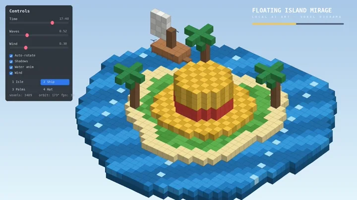
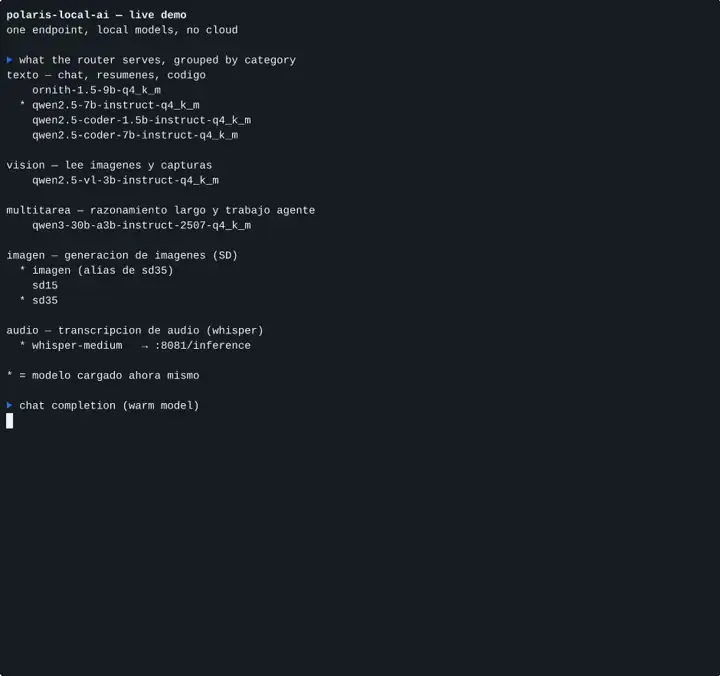

# polaris-local-ai

[**English**](README.md) · [Español](README.es.md)

<p align="center">
<a href="https://github.com/AvilaCarlosDev/polaris-local-ai/actions/workflows/ci.yml"></a>
<a href="LICENSE"></a>
<a href="https://github.com/AvilaCarlosDev/polaris-local-ai/releases"></a>
<a href="docs/HARDWARE.md"></a>
</p>

**A full local AI stack — text, vision and image generation — on an AMD Radeon
RX 580 2048SP (8 GB VRAM) with 32 GB of RAM.** No cloud, no API bills. It also
serves as the inference engine for an AI coding/assistant agent (Hermes Agent).

**What you are watching:** a demo scene rendered and encoded on the RX 580. It shows the box doing real work end to end, not a model output by itself.

<p align="center"><a href="https://github.com/AvilaCarlosDev/polaris-local-ai/releases/download/v0.2.0/hero-scene-720.mp4"></a><br>
<sub><a href="https://github.com/AvilaCarlosDev/polaris-local-ai/releases/download/v0.2.0/hero-scene-720.mp4">FLOATING ISLAND MIRAGE (29 s)</a> — 870 frames rendered and encoded on the local machine, title generated by the local qwen2.5-7b</sub></p>

**Second clip:** one command lists every model the router serves, a chat request is answered in 6.1 s, and an image generation starts with SD 3.5. Everything runs on the RX 580; nothing leaves the machine.

<p align="center"><a href="https://github.com/AvilaCarlosDev/polaris-local-ai/releases/download/v0.2.0/hero.mp4"></a><br>
<sub><a href="https://github.com/AvilaCarlosDev/polaris-local-ai/releases/download/v0.2.0/hero.mp4">full video (29 s)</a> — one real run: 57 s wall clock, played at 2×</sub></p>

> **Inspired by [Strata](https://github.com/Niko1221/Strata).**
> Strata proved that a serious local inference stack can be packaged so a normal
> person can run it on a normal PC. This repository follows that same idea —
> one install script, an OpenAI-compatible API on localhost, docs with real
> numbers — but for older hardware and with a different engine. No Strata code
> is included. Credits to its author for the concept and the bar it set.
> See [NOTICE](NOTICE) for the full attribution notice.

---

## Why this exists

Strata targets 12 GB+ cards from the RX 6800 series upward, and its AMD path
requires ROCm 7, which dropped the Polaris architecture years ago. An RX 580 —
still a very common card — is out of scope for it.

This stack does not care. It runs over **Vulkan through Mesa's RADV driver**,
which supports Polaris perfectly, and leans on **32 GB of system RAM** for the
models that do not fit in 8 GB of VRAM. The result: six text/vision models
and two image models, all reachable through a single OpenAI-compatible endpoint.

## What you get

| | |
|---|---|
| **Text** | 6 models, from a 1.5 B coder up to a 30 B MoE, swapped on demand |
| **Vision** | Qwen2.5-VL 3 B with its mmproj projector |
| **Images** | SD 3.5 Medium and SD 1.5 through stable-diffusion.cpp |
| **API** | One OpenAI-compatible endpoint, one API key, 6 text/vision ids + image generation |
| **Selector** | `ia-models` lists every id the router serves, grouped by category |
| **Agent** | Works as the backend engine for Hermes Agent, with MCP tools |
| **Footprint** | Runs in a Debian LXC on a Proxmox host, or on bare metal |

Measured numbers, the install steps, the model guide and everything that broke
along the way are in [`docs/`](docs/):

- [EXPECTATIONS.md](docs/EXPECTATIONS.md) — **start here**: what to expect and how to use it correctly
- [HARDWARE.md](docs/HARDWARE.md) — what runs on this card and what cannot
- [BENCHMARKS.md](docs/BENCHMARKS.md) — tokens/second, cold vs warm, agent latency — measured
- [MODELS.md](docs/MODELS.md) — which model for which job
- [SETUP.md](docs/SETUP.md) — install from scratch
- [PORTABLE.md](docs/PORTABLE.md) — the second machine: llama.cpp in normal RAM on a GPU-less laptop
- [HERMES.md](docs/HERMES.md) — using it as an agent engine
- [TROUBLESHOOTING.md](docs/TROUBLESHOOTING.md) — the bugs we hit

## What it actually feels like

Measured on this machine, not estimated. Same prompt, same model, two states:

| Situation | Wall time |
|---|---:|
| **Warm** API call, model already loaded | **3.1 – 14.1 s** |
| **Cold** API call, right after a model swap | **11.0 – 55.0 s** |
| First message to an agent, new session | **~161 s** |
| Every later message in that same session | **~21 – 25 s** |

**Row 1 vs row 2 is the swap** — 7.9–38.5 s to restart llama-server with new
weights. Generation speed is identical in both states (21–99 tok/s); a cold
model is not slower, it is slow to *arrive*. Keep one model loaded for the
whole session and you live in row 1.

**Row 2 vs row 3 is the agent, not the GPU.** Hermes sends a **~20,100-token
prompt** (55 KB of identity plus 27 tool schemas), so the model spends ~124 s
reading your sentence before answering it in ~2.5 s. Prompt caching collapses
that to 25–71 tokens on turns 2+, and ~11.7 s of every turn is the agent CLI
restarting per invocation.

Full breakdown:
[BENCHMARKS.md](docs/BENCHMARKS.md) ·
[What to expect and how to use it](docs/EXPECTATIONS.md).

## Quick start

```bash
./setup.sh
```

The script checks your GPU, Vulkan driver, RAM and disk, builds what is
missing, installs the systemd units and starts the router. It refuses to
proceed if your hardware cannot run the stack — see
[HARDWARE.md](docs/HARDWARE.md) for the exact requirements.

Then:

```bash
export IA_API_KEY=your-key
curl http://127.0.0.1:8090/v1/chat/completions \
  -H "Content-Type: application/json" \
  -H "Authorization: Bearer $IA_API_KEY" \
  -d '{"model":"qwen2.5-7b-instruct-q4_k_m",
       "messages":[{"role":"user","content":"Hello"}]}'
```

## Picking a model

Ask the router what it serves instead of guessing from the docs:

```bash
ia-models               # every id, grouped by category
ia-models -c vision     # one category only
ia-models --json        # raw list for scripts
```

| Category | Ids | Reach for it when |
|---|---|---|
| `texto` | 1.5 B coder → 7 B, plus ornith 9 B | chat, summaries, code |
| `vision` | Qwen2.5-VL 3 B | the job involves an image |
| `multitarea` | Qwen3-30B-A3B (3 B active) | long reasoning, agent work |
| `imagen` | SD 3.5 Medium, SD 1.5 | you want a picture |
| `audio` | whisper medium | transcription — its own service, listed only when installed |

The categories come from the endpoint itself (`GET /v1/models`), so the list
stays truthful: an `*` marks the model loaded right now, and nothing in the
table can drift away from what the router actually runs. Model-by-model
trade-offs are in [MODELS.md](docs/MODELS.md).

## Repository layout

```
router.py              OpenAI-compatible router: swaps models on demand
image-mcp.py           Image generation bridge
clients/ia-imagen      CLI to generate an image and save it locally
clients/ia-models      CLI listing every model, grouped by category
scripts/hero-demo.sh   The script behind the video above — run it yourself
systemd/               The units that run the stack
docs/                  Hardware notes, benchmarks, setup, gotchas
setup.sh               One-shot installer
```

## Credits and licence

- **[Strata](https://github.com/Niko1221/Strata)** — MIT, by its author. The
  inspiration for this project's scope and packaging. Not a fork; no Strata
  source code is present here.
- **[llama.cpp](https://github.com/ggml-org/llama.cpp)** — the text and vision
  inference engine.
- **[stable-diffusion.cpp](https://github.com/leejet/stable-diffusion.cpp)** —
  the image engine.
- **[Qwen](https://qwen.ai/)**, **Ornith**, **ISTA-DASLab** — model families
  used here; each carries its own licence.

This repository is MIT-licensed. Model weights are **not** included and keep
their own licences.
